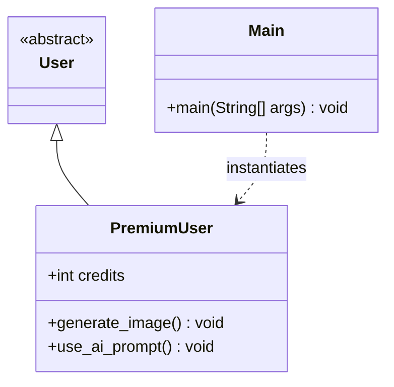

# Design Document: premium-user-oop

## Overview

This feature implements a small Java OOP hierarchy that demonstrates the **inheritance** pillar of object-oriented programming. An abstract `User` class defines the common base type; a concrete `PremiumUser` subclass extends it with a credit-based system that gates access to AI image generation.

The design is intentionally minimal: no persistence, no external services, no frameworks. The entire feature lives in plain Java source files and is exercised through a `main` entry point.

---

## Architecture

The system is a single-process Java application composed of three compilation units:

```
User          (abstract class)
  └── PremiumUser  (concrete class)

Main          (entry point — creates PremiumUser and calls both methods)
```

All classes reside in the default package (or a single named package such as `com.example`). No external libraries are required.



---

## Components and Interfaces

### `User` (abstract class)

- Declared `abstract` so it cannot be instantiated directly.
- Not declared `final`, allowing subclasses.
- Serves as the polymorphic base type; concrete behaviour lives in subclasses.
- No abstract methods are required by the current specification, but the class may be extended with shared state or abstract methods in future iterations.

### `PremiumUser` (concrete class)

Extends `User`. Owns the credit balance and exposes two public methods:

| Method | Signature | Behaviour |
|---|---|---|
| `generate_image` | `public void generate_image()` | Subtracts 5 from `credits`, then prints a success message. |
| `use_ai_prompt` | `public void use_ai_prompt()` | Calls `generate_image()` only when `credits > 5`; otherwise does nothing. |

### `Main` (entry point)

Contains the `public static void main(String[] args)` method. Responsibilities:

1. Instantiate `PremiumUser`.
2. Call `use_ai_prompt()`.
3. Call `generate_image()` directly.

---

## Data Models

### `PremiumUser` state

| Field | Type | Initial value | Invariant |
|---|---|---|---|
| `credits` | `int` | `100` | Decremented by 5 on each `generate_image()` call; never explicitly bounded below zero by the current spec. |

There is no persistent state; the object lives only for the duration of the JVM process.

---

## Correctness Properties

*A property is a characteristic or behavior that should hold true across all valid executions of a system — essentially, a formal statement about what the system should do. Properties serve as the bridge between human-readable specifications and machine-verifiable correctness guarantees.*

### Property 1: Credit deduction on image generation

*For any* `PremiumUser` instance with an initial credit balance `c`, calling `generate_image()` once SHALL result in a credit balance of exactly `c - 5`.

**Validates: Requirements 4.2**

### Property 2: use_ai_prompt delegates when credits > 5

*For any* `PremiumUser` instance whose `credits` value is greater than `5`, calling `use_ai_prompt()` SHALL result in `credits` being decremented by exactly `5` (i.e., `generate_image()` was called exactly once).

**Validates: Requirements 5.2**

### Property 3: Guard blocks generation when credits ≤ 5

*For any* `PremiumUser` instance whose `credits` value is `5` or less, calling `use_ai_prompt()` SHALL leave `credits` unchanged (i.e., `generate_image()` is NOT called).

**Validates: Requirements 5.3**

### Property 4: Credit deduction is additive across multiple calls

*For any* `PremiumUser` instance with initial credits `c` and any non-negative integer `n`, calling `generate_image()` exactly `n` times SHALL result in a credit balance of exactly `c - (5 * n)`.

**Validates: Requirements 4.2**

---

## Error Handling

The current specification does not require error handling for insufficient credits — `use_ai_prompt()` silently does nothing when credits are insufficient. The following edge cases are noted for completeness:

| Scenario | Specified behaviour | Notes |
|---|---|---|
| `credits == 5` | `use_ai_prompt()` does NOT call `generate_image()` (guard condition is `> 5`) | Boundary case; credits must be strictly greater than 5. |
| `credits == 0` or negative | `use_ai_prompt()` does NOT call `generate_image()` | No explicit lower bound enforced by spec. |
| `generate_image()` called directly with 0 credits | Credits become negative | Spec does not prohibit this; direct calls bypass the guard. |

No exceptions are thrown; the system uses conditional logic rather than exception-based flow control.

---

## Testing Strategy

### Unit Tests (JUnit 5)

Unit tests cover specific examples and boundary conditions:

| Test | What it verifies |
|---|---|
| `testInitialCredits` | New `PremiumUser` has `credits == 100` (Req 3.2) |
| `testGenerateImageDecrementsCredits` | After one `generate_image()` call, `credits == 95` (Req 4.2) |
| `testGenerateImagePrintsSuccess` | `generate_image()` prints a non-empty success message to stdout (Req 4.3) |
| `testUseAiPromptCallsGenerateWhenSufficient` | With `credits > 5`, `use_ai_prompt()` decrements credits by 5 (Req 5.2) |
| `testUseAiPromptBlocksWhenCreditsExactly5` | With `credits == 5`, `use_ai_prompt()` leaves credits unchanged (Req 5.3 boundary) |
| `testUseAiPromptBlocksWhenCreditsZero` | With `credits == 0`, `use_ai_prompt()` leaves credits unchanged (Req 5.3) |
| `testMainRunsWithoutException` | `Main.main()` executes without throwing (Req 6) |

### Property-Based Tests (jqwik)

Property-based tests use [jqwik](https://jqwik.net/) (a JUnit 5-compatible PBT library for Java). Each test runs a minimum of **100 iterations**.

Each test is tagged with a comment in the format:
`// Feature: premium-user-oop, Property N: <property_text>`

| Property test | Generates | Verifies |
|---|---|---|
| `prop_creditDeductionOnGenerate` | Random initial credit values | After one `generate_image()`, credits == initial - 5 (Property 1) |
| `prop_useAiPromptDelegatesWhenSufficient` | Random credit values > 5 | `use_ai_prompt()` decrements credits by 5 (Property 2) |
| `prop_useAiPromptBlocksWhenInsufficient` | Random credit values ≤ 5 | `use_ai_prompt()` leaves credits unchanged (Property 3) |
| `prop_additiveDeduction` | Random initial credits and call count n (0–20) | After n calls to `generate_image()`, credits == initial - (5 * n) (Property 4) |

**Note:** Properties 1 and 4 overlap — Property 4 subsumes Property 1 (n=1 is a special case of n calls). Both are retained because Property 1 is simpler and serves as a clear single-call regression test, while Property 4 validates the additive invariant across multiple calls.

### Test Setup

```xml
<!-- pom.xml dependency for jqwik -->
<dependency>
    <groupId>net.jqwik</groupId>
    <artifactId>jqwik</artifactId>
    <version>1.8.4</version>
    <scope>test</scope>
</dependency>
<dependency>
    <groupId>org.junit.jupiter</groupId>
    <artifactId>junit-jupiter</artifactId>
    <version>5.10.2</version>
    <scope>test</scope>
</dependency>
```
